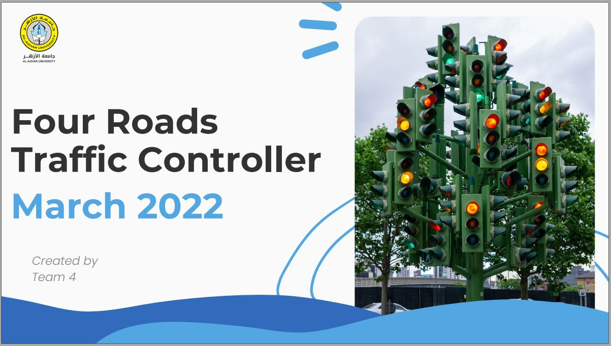

  

<h1 align="center">4Traffic Controller</h1>
<h4 align="center">An Arduino-based, small scale, cross-traffic controller .</h4>

  <b>Welcome to our mini arduino project, created to showcase the usage of automation in solving real-life problems</b> 
   Traffic jam is one of the most common problems in modern society, and among many solutions comes the idea of automating a model to anticipate and the solve the jamming logically, and for the purpose of demonstration this project is written in C++ and implemented on Arduino-Mega chip.

## ➤ Table of Contents

* [➤ Introduction & Hypothesis](#-Introduction-&-Hypothesis)
* [➤ Tools and Components](#-tools-and-components)
* [➤ Diagrams](#diagrams)
* [➤ Contributors](#-contributors)
* [➤ License](#-license)

## ➤ Introduction & Hypothesis

This is an app made by a student, for students, to have a safe community hub.

This includes :

* ➤ Email Uni verification

* ➤ Safe posts/chats between students

* ➤ Uni communities as groups

## ➤ Tools and Components

This getting started guide is how far we are from. Anyone is welcomed to hop in and help us improve the application.

Join the Discord server here : [Discord Server](https://discord.gg/93gDcmqABV)

* **Police used** : Merriweather, SF Pro
* **Icons used** : In the Assets folder :)
* **Main colors used** : 002251, 0041C4

What's almost ready :

➤ Welcome page with splash screen ( Find images for splash screen)

➤ Login page

➤ Sign up page

➤ Forgot password page

To be made :

 ➤ Implement Firebase

 ➤ Edit sign-up page and add a dropdown list to select from .json list of uni

 ➤ Home page (news, posts feed like template)

 ➤ Messages page

 ➤ Profile page

## ➤ Diagrams

You will find here images of the screens made (or to be made)
Don't hesitate to hop in !

Figma file : [Figma template](https://www.figma.com/file/iAYXkVJbIJ273gnuGgQ73u/Uni?node-id=0%3A1)

| Name     |            Link                 |
|----------|---------------------------------|
| Home     | https://imgur.com/ylpGmDK.png   |
| Messages | https://i.imgur.com/N1isGsF.png |

## ➤ Contributors

Coming :)

## ➤ License

Licensed under [MIT](https://opensource.org/licenses/MIT).

