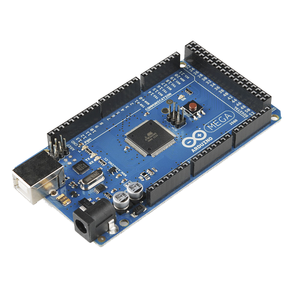
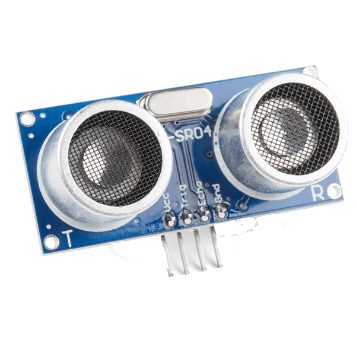
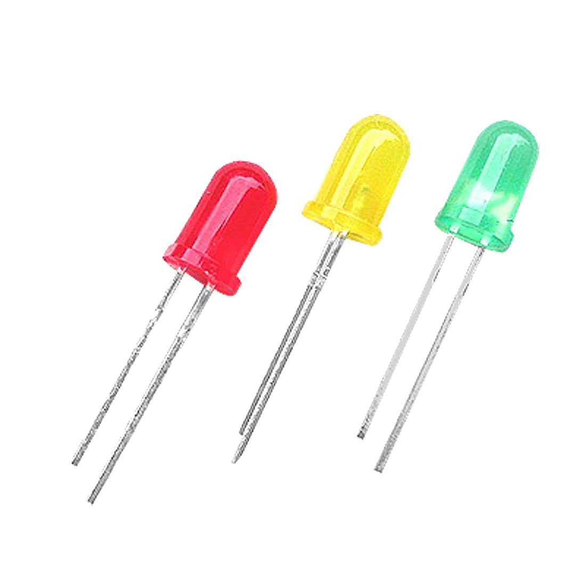
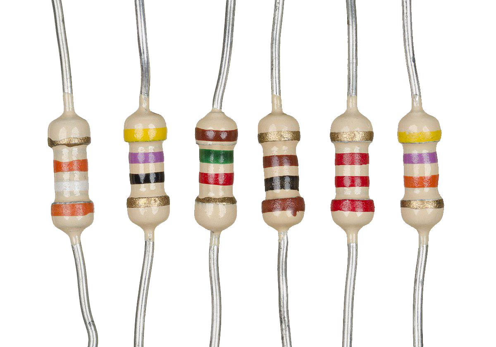
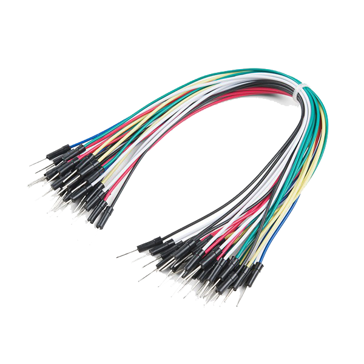
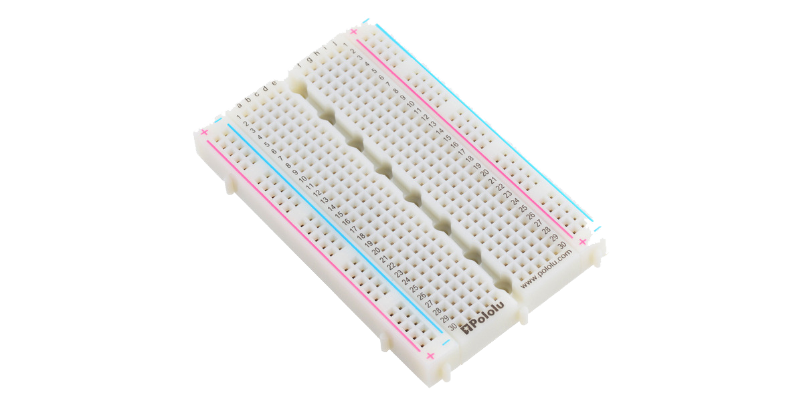
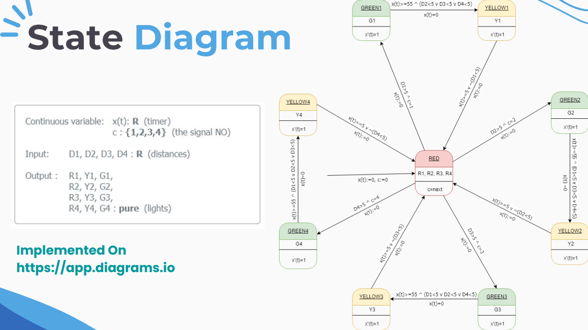

  

# <h1 align="center">4Traffic Controller</h1>
<h4 align="center">An Arduino-based, small scale, cross-traffic controller .</h4>

  <b>Welcome to our mini arduino project, created to showcase the usage of automation in solving real-life problems</b> 
   Traffic jam is one of the most common problems in modern society, and among many solutions comes the idea of automating a model to anticipate and the solve the jamming logically, and for the purpose of demonstration this project is written in C++ and implemented on Arduino-Mega chip.

## ➤ Table of Contents

* [➤ Introduction & Hypothesis](#-Introduction-&-Hypothesis)
* [➤ Tools and Components](#-tools-and-components)
* [➤ Diagrams](#-diagrams)
* [➤ Contributors](#-contributors)
* [➤ License](#-license)

## ➤ Introduction & Hypothesis

This traffic light controller will be used to control the flow of traffic.
These can be applied at high traffic areas to avoid traffic blocks or accidents.
The main part of this project is the Arduino which will control the LEDs and their timings to guide the vehicles.

## ➤ Tools and Components
 <b>Here is a list with all hardware components used in the project </b> 

| Component   |    Quantity     |
|-------------|-----------------|
| Arduino Mega 2560  | (x1) |
| Ultrasonic Sensor HC-SR04 | (x4) |
| Generic LEDs Red-Green-Yellow | (x4) |
| Generic Resistors 220 Ohm | (x12) |
| Jumber Wires | (xN) |
| Breadboards  | (x4) |
<!--
| Component Xquantity  |    Thumbnail     |
|--------------------- |------------------|
| Arduino Mega 2560 x1 | |
| Ultrasonic Sensor HC-SR04 (x4) | |
| Generic LEDs (x4) Red-Green-Yellow |  |
| Generic Resistors (x12) 220 Ohm |  |
| Jumber Wires (xN) |  |
| Breadboards (x4) |  |
-->

## ➤ Diagrams

 <b>State Diagram</b> 

  

 <b>Circuit Diagram</b> 
 

  

## ➤ Contributors

Coming :)

## ➤ License

Licensed under [MIT](https://opensource.org/licenses/MIT).

